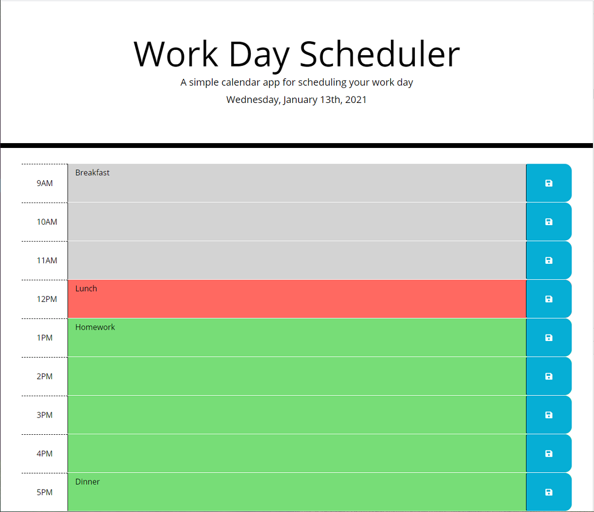

# 05 Third Party APIs: DailyPlanner

## Description

This is a simple calendar application that allows a user to save events for each hour of the day.

## Screenshot

## Repository:

https://github.com/jrdrenth/DailyPlanner

## Website:

https://jrdrenth.github.io/DailyPlanner/